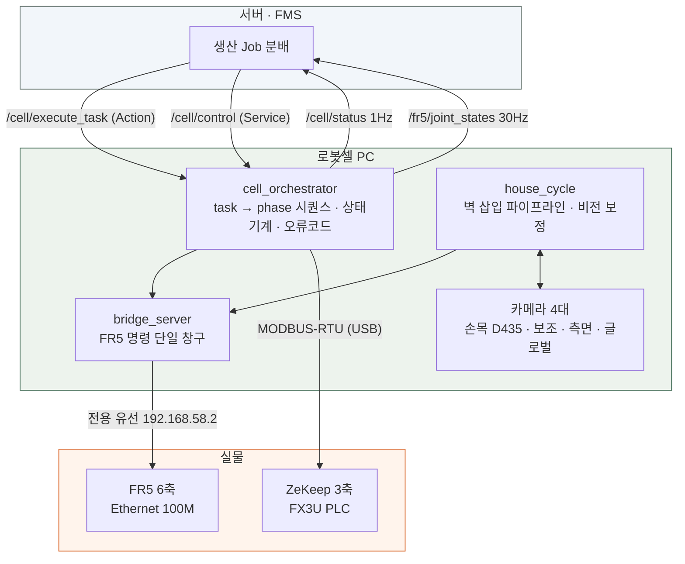

<div align="center">

# 조립식 주택 자동 조립 로봇셀

**FR5 6축 협동로봇이 벽을 집어 밑판 슬롯에 끼웁니다. 사람은 하강 버튼만 누릅니다.**

카메라로 잰 화면 픽셀을 로봇 mm 로 바꾸는 매핑을 실측으로 만들고,
매 사이클 밑판과 랙을 다시 측정해 **기준이 움직여도 따라가는** 픽 & 플레이스를 구현했습니다.


</div>

---

## 무엇을 만들었나

조립식 주택 모형을 로봇이 조립하는 팀 프로젝트에서 **로봇셀(FR5 + ZeKeep) 전체**를 맡았습니다.
서버가 `"외벽 한 장 설치"` 라는 작업을 보내면, 그것을 **실물 로봇의 0.1mm 단위 동작**으로 바꾸는 계층 전부입니다.

| | |
|---|---|
| **FR5 6축** | 랙에서 벽을 집어 밑판 슬롯에 삽입 — 외벽 4장 + 내벽 (집 타입별 1~2장) |
| **ZeKeep 3축** | 밑판·지붕 흡착 반송 — MODBUS-RTU 로 미쓰비시 FX3U PLC 직접 제어 |
| **서버 인터페이스** | ROS2 Action / Service / Topic 규격을 서버팀과 합의하고 구현 (일시정지·재개 포함) |
| **자체 비전 보정** | 카메라 4대로 파지·삽입 오차를 잡는 보정 계통 (팀 비전 파트의 YOLO 검사와는 별개) |

> 벽은 기둥 사이 홈에 끼우는 구조라, **밑판이 조금만 틀어져도 벽 밑동이 기둥에 걸립니다.**
> 그래서 "정확한 좌표로 보낸다"가 아니라 **"틀어진 만큼 매번 다시 재서 따라간다"** 로 설계했습니다.

---

## 핵심 결과

<div align="center">

| 지표 | 값 | 측정 방법 |
|:---|:---:|:---|
| 벽 5장 연속 삽입 | **5 / 5** · 하강 중 막힘 0건 | 9/8 밤 · 9/9 밤 각 1회차, 로그 `── DONE` 확인 |
| 사이클당 사람 개입 | **1회** (하강 버튼) | 정렬 완료 후 사용자 확인 — 안전상 의도한 설계 |
| 벽 1장 로봇 구간 | **중앙값 304초** (n=92, 201~1618s) | 사람 대기 시간 제외, 전체 개발 로그 집계 |
| 파지 재현 오차 | **1.7mm → 0.13mm** | 같은 벽 반복 파지 후 TCP 편차 |
| 베이스 자세 측정 | **rms 1.5mm · σ 0.014°** | 기둥 색점 4점, 매 사이클 재측정 |
| 정렬 수렴 잔차 | **0.41mm** | 로봇 최소 실행 이동량(0.5mm) 아래 = 한계 수렴 |
| 안착 자동 판정 | **4.2 / 5.6 px** (허용 12px ≈ 2.5mm) | 기둥 점 2개가 안착 기준 자리와 일치하는지 |
| 완성품 출하 이송 | **도달 오차 ≤ 0.05mm** | 포크 손잡이 파지 후 출하지까지 6단계 이동 |

</div>

> **수치를 읽는 법** — "5/5" 는 *한 회차에서 다섯 장이 모두 들어갔다* 는 뜻이지 성공률이 아닙니다.
> 개발 기간 전체로는 **완주 92회 · 게이트 정지 37회 · 예외 정지 83회** 가 로그에 남아 있고,
> 정지 대부분은 티칭·튜닝 중이거나 카메라가 죽은 경우입니다. 과장하지 않으려고 그대로 적습니다.

---

## 시스템 구조



**3계층으로 나눈 이유** — 작업(무엇을) · 순서(어떻게) · 하드웨어(무슨 명령으로) 를 분리해,
로봇이 바뀌어도 상위 계층은 건드리지 않게 했습니다. 모의(sim) 어댑터로 전 시퀀스를 먼저 통과시킨 뒤 실물에 투입합니다.

---

## 벽 한 장이 들어가기까지

```
① BASE      빈손으로 관측자세 → 밑판 기둥 색점 4점으로 베이스 위치·회전 측정
② RACK      랙 관측 → 벽 색점으로 파지 중심 계산 → 파지        ├ 게이트: 파지 편차 1.0mm / 0.7°
③ CARRY     안전 고도로 운반 → 슬롯 위 정렬 높이(z_seat+85)
④ ALIGN     든 벽의 점 ↔ 밑판 고정 특징을 같은 사진에서 비교    ├ 게이트: 정렬 이동 상한 4mm
⑤ DESCEND   3mm 단계 하강 + 벽 점 밀림 감시                      ├ 게이트: 막히면 그 자리 정지
⑥ SEAT      기둥 점 2개로 안착 판정 → 그리퍼 개방 → 상승
```

**외벽 4장 → 내벽 마지막** 이 순서는 물리적 강제입니다. 내벽을 먼저 넣으면 밑판 뎁스 검출이 반으로 갈려 기둥을 못 찾습니다.

---

## 어떻게 정밀도를 얻었나

### 1. 자코비안을 문서가 아니라 실측으로 만든다

카메라 외부 파라미터를 풀지 않고, **로봇을 ±10mm 조그시켜 픽셀이 얼마나 움직이는지 직접 재서** 역행렬을 만듭니다.

```python
# 로봇이 ΔX 움직이면 화면 점은 p + J·ΔX 로 간다.
# 점 P 를 화면 기준 c 로 가져오려면 ΔX = J⁻¹·(c − p)
dmm = Jinv @ np.array([c[0] - p[0], c[1] - p[1]])
```

렌즈 왜곡·설치 각도가 전부 측정값 안에 흡수되므로, 카메라를 옮기면 **다시 재기만 하면 됩니다.**
자세마다 값이 다르기 때문에 자세별로 따로 측정합니다.

### 2. 절대 좌표를 쓰지 않고, 같은 프레임 안의 상대 오차로 정렬한다

정렬 높이에서 **① 그리퍼가 든 벽의 색점**과 **② 밑판의 고정 특징(기둥 꼭짓점·ArUco)** 을 한 장의 사진에서 같이 봅니다.
저장해 둔 기준 사진과 비교해 차이를 0 으로 만드는 이동량만 계산합니다.

> 책상이 2mm 올라가 기준이 전부 무효가 된 날에도 **XY 는 살아남았습니다.** 절대 좌표를 안 썼기 때문입니다.

### 3. 로봇의 최소 실행 이동량 아래로는 명령하지 않는다

| 명령 | 실제 이동 | 실행률 |
|---:|---:|---:|
| 0.30 mm | 0.000 mm | **0 %** |
| 0.50 mm | 0.505 mm | 100 % |
| 0.70 mm | 0.705 mm | 100 % |

그보다 작은 명령은 **로봇이 조용히 버리는데 브리지는 `started` 로 답합니다.**
검증 기준이 실행 분해능보다 촘촘하면 영원히 수렴하지 않습니다 — 그래서 한계에 닿으면 수렴으로 간주하고 멈춥니다.

### 4. 부호는 오차가 0 이 아닌 상태에서만 검증된다

포크 리프트의 위치 보정이 **부호가 반대**인 채로 하루를 넘겼습니다.
손잡이가 기준 자리에 정확히 있어 `Δ ≈ 0` 이었고, **0 은 부호를 뒤집어도 0** 이라 버그가 실행된 적이 없었습니다.

```
옛 부호:  Δpx(−7.2,+6.5) → (−1.90,−1.67)mm 이동 → 잔차 Δpx(−14.6,+10.5)   ← 2배로 커짐
새 부호:  Δpx(−7.4,+6.6) → (+1.95,+1.69)mm 이동 → 잔차 Δpx(−0.4,+1.3)     ← 한 번에 수렴
```

이후 **픽셀→로봇 보정은 일부러 틀어놓고(Δ≠0) 시험한 뒤에야 "검증됨"** 으로 부릅니다.

---

## 안전 설계 — 게이트는 통과 장치가 아니라 감지기다

로봇이 부품을 밀거나 기둥을 부러뜨리는 사고를 겪고 나서 세운 원칙입니다.
**게이트에 걸리면 완화하지 않고, 검출을 보강하거나 사람에게 넘깁니다.**

| 게이트 | 임계 | 걸리면 |
|:---|:---|:---|
| 파지 편차 | 1.0 mm / 0.7° | 사람에게 계속/중단을 묻는다 |
| 정렬 이동 상한 | 4.0 mm | 정지 — 시차로 파지 오차가 2배 증폭되므로 **재파지가 답** |
| 하강 중 밀림 감시 | 3mm 단계, 누적 픽셀 감시 | 그 자리에서 정지 |
| 벽 길이 검증 | 기준 ±2 % | 끝점이 잘렸다는 뜻 → 파지 금지 |
| J6 대회전 봉인 | \|ΔJ6\| > 180° | 이동 거부 (컨트롤러 동결 방지) |
| 실패 후 복귀 | — | **로봇이 부품을 랙에 되돌리지 않는다.** 사람이 처리 |

---

## 문제 해결 사례

<details>
<summary><b>① 하루 종일 벽이 6mm 위에서 멈췄다 — 범인은 화이트밸런스 한 줄</b></summary>

**증상** — 전날 저녁까지 되던 삽입이 종일 실패. 벽이 안착 지점 6mm 위에서 멈춘다.

**내가 먼저 한 일 (전부 틀렸다)** — 면적 게이트 완화, 감시 없는 꼬리 하강 등 3건을 넣었다.
증상은 가려졌지만 **막힌 벽을 계속 눌러 밑판을 밀었다.**

**대조군** — 같은 자리·같은 노출에서 **화이트밸런스만** 4600 ↔ 5500 으로 2회 교차:

| WB | 파랑 색점 면적 |
|---:|---:|
| 4600 | **1823** |
| 5500 | **258** |

**진범** — 카메라 런처가 WB 5500 을 박아넣고 있었다. 카메라 서버 자체 기본값은 4600 이라,
**카메라가 재기동될 때마다 되살아났다.**

**해결** — 런처 · 자동복구 데몬 · 사이클 시작 점검 **3중으로 고정.** 완화했던 3건은 전부 원복.
→ 그날 밤 다섯 벽 전량 삽입, 막힘 0건.

**배운 것** — 증상을 누르면 원인은 그대로 남는다. 변수를 하나만 바꿔 재현하는 대조군이 범인을 지목했다.

</details>

<details>
<summary><b>② 정렬이 파지 오차를 2배로 증폭한다 — 보정이 아니라 재파지가 답</b></summary>

내벽 한 장이 랙 끝에 치우쳐 꽂혀 파지 편차가 **길이 방향 +2.38mm** 로 나왔다.
그대로 진행했더니 정렬이 **5.5mm** 를 옮기려 해서 상한(4mm) 게이트에 걸려 정지.

**원인** — 든 벽의 점은 카메라에 가깝고 밑판 특징은 멀다. 시차 때문에 파지 오차가 정렬 이동량에서 약 2배로 증폭된다.

**검증** — 사람이 다시 잡게 하니 파지 편차 **+0.92mm → 정렬 이동 1.3mm** 로 떨어지고 그대로 삽입 성공.
알고리즘이 아니라 **파지가 원인**이었다는 대조군이 됐다.

→ 이후 이 게이트는 "정렬 실패"가 아니라 **"재파지하라는 신호"** 로 해석한다.

</details>

<details>
<summary><b>③ 기준 사진이 다른 벽의 점 위에 세워져 있었다</b></summary>

짧은 빨강 벽의 정렬이 `축척 1.094` 로 거부됐다. 기준 사진의 "밑판 고정 특징" 14개가
알고 보니 **대부분 먼저 꽂힌 다른 벽들의 색점**이었다. 벽 구성이 달라지면 기준이 통째로 흔들리는 구조.

**해결 2가지**
1. 움직이지 않는 **ArUco 마커 중심을 정렬 특징에 추가** — 벽이 바뀌어도 남는 닻
2. 기준·조명·높이를 **4분 안에 한 번에** 다시 잡는 절차로 표준화 (`z_seat + 85` 고정)

**부수 발견** — 기준 벽 점이 2개인데 측정이 3개(조각/반사)면 배열 뺄셈에서 크래시가 났다.
기준 벽 점이 1개였던 동안 숨어 있던 결함이다. 최근접 1:1 짝짓기로 고치고, 짝이 멀면 거부하도록 했다.

</details>

<details>
<summary><b>④ "MoveIt SUCCESS 인데 실물이 안 움직인다" 계열</b></summary>

- **컨트롤러 알람** → `ResetAllError()` 로 복구 (전원 재투입 불필요)
- **링크가 죽는다** → FR5 포트 100M vs NIC 2.5G **오토네고 협상 실패**. speed/duplex 고정으로 영구 해결
- **탈조 유령 이동** (ZeKeep) → 카운터만 움직이고 실물은 그대로인데 **성공 로그가 남는다.** 육안 확인 외 검출 수단 없음
- **무동작인데 성공 응답** → `MotionDone status=1` 은 "안 움직이는 중" 이라는 뜻

공통 교훈: **성공 로그를 믿지 말고 결과를 따로 측정한다.**

</details>

---

## 실무자가 먼저 묻는 것 5가지

> 데모데이 Q&A(10분) 대비로 정리했습니다. **모르는 건 모른다고, 안 한 건 안 했다고 적었습니다.**

<details open>
<summary><b>Q1. 핸드아이 캘리브레이션을 안 하고 자코비안을 실측했다는데, 왜 그렇게 했나?</b></summary>

**A.** 카메라 내·외부 파라미터를 풀지 않고, **로봇을 ±10mm 조그시켜 픽셀이 얼마나 움직이는지 직접 재서** 역행렬 `J⁻¹`(mm/px)을 만들었습니다.

**그렇게 한 이유**
- 프로젝트 중 카메라 마운트를 두 번 교체했습니다. 정식 캘리브레이션이면 그때마다 체커보드 촬영·최적화를 다시 해야 하는데, 실측은 **조그 몇 번이면 끝납니다.**
- 렌즈 왜곡·설치 각도·툴 오프셋이 **전부 측정값 안에 흡수**됩니다. 모델이 틀려도 결과는 맞습니다.
- 우리가 필요한 건 3D 복원이 아니라 **"화면에서 이만큼 어긋났는데 로봇을 얼마나 옮기면 되나"** 하나뿐이었습니다.

**대가 (이게 질문의 핵심입니다)**
- **자세마다 다시 재야 합니다.** 관측자세용, 랙용, 정렬 높이용을 따로 가지고 있습니다.
- 측정한 자세에서 멀어지면 안 맞습니다. 그래서 **높이 차이를 축척으로 보정**(`d_h / D_OBS`)하고, 기준 사진과 높이가 3mm 넘게 다르면 아예 거부합니다.
- 3D 위치를 모르므로 **임의의 자세로 일반화가 안 됩니다.** 작업이 정해진 셀이라 성립한 선택입니다.

**다시 한다면** — 셀이 커지거나 자세가 늘어나면 정식 외부 파라미터로 가는 게 맞습니다. 지금 방식은 **자세 수가 적고 설치가 자주 바뀌는 환경**에 맞춘 트레이드오프입니다.

</details>

<details open>
<summary><b>Q2. 힘·토크 센서 없이 삽입을 어떻게 보장하나? 충돌은 어떻게 막나?</b></summary>

**A. 카메라를 힘 센서 대신 씁니다.** 3mm씩 내려가면서 **그리퍼가 문 벽의 색점이 화면에서 밀리는지** 봅니다.
벽이 기둥에 걸리면 로봇은 계속 내려가는데 벽은 못 내려가므로, **그리퍼 안에서 벽이 밀리고 그게 픽셀 이동으로 보입니다.**

| 층 | 수단 |
|:---|:---|
| 1차 | 하강 중 벽 점 밀림 감시 — 단계별·누적 픽셀 임계 초과 시 그 자리 정지 |
| 2차 | 그리퍼 실측값 감시 — 파지 직후 값에서 벌어지면 놓치는 중 |
| 3차 | 충돌 레벨 설정 + **페이로드 등록**(0.7kg, 무게중심 등록) — 미등록 시 수동 모드에서 팔이 떨어진 사고가 있었습니다 |
| 4차 | J6 대회전 봉인 — `\|ΔJ6\| > 180°` 이동 거부 (컨트롤러 동결의 진범이었습니다) |

**한계도 같이 말씀드립니다 — 실제로 겪었습니다.**
무정지 하강 중 타임아웃을 오판해 **기둥을 부러뜨린 적이 있습니다.** 그때 배운 건
> **기둥이 그리퍼 마찰보다 먼저 부러지면 '카메라 힘 센서'는 원리적으로 무력하다.**

벽이 안 밀리고 기둥이 먼저 부러지므로 픽셀에 아무 변화가 없습니다.
그래서 **무정지 하강을 폐기**하고 잔스텝 감시 진입으로 바꿨습니다(성공 2·감지 2 vs 무정지 파손 1).
**진짜 해결은 힘 센서나 순응 그리퍼**이고, 지금 구조는 그 전까지의 차선책입니다.

</details>

<details open>
<summary><b>Q3. 벽 1장에 304초면 느리다. 병목이 어디고 어떻게 줄일 건가?</b></summary>

**A. 재봤습니다. 하강이 35%, 랙 측정이 28% 입니다.** (완주 92 사이클, 단계별 중앙값)

| 단계 | 중앙값 | 비중 | 무엇을 하나 |
|:---|---:|---:|:---|
| **DESCEND** | **82 s** | 35 % | 정렬 높이(+85mm)에서 **3mm씩 약 28회** — 매 단계 촬영·검출·이동 |
| **RACK** | **66 s** | 28 % | 다중 프레임 중앙값 측정 + 노출 안정 대기(1.4s) + 접근 이동 |
| CARRY | 30 s | 13 % | 안전 고도 경유 운반 |
| RELEASE | 27 s | 11 % | 그리퍼 개방 + 상승 |
| BASE | 19 s | 8 % | 빈손 밑판 재측정 |
| ALIGN | 13 s | 5 % | 정렬 반복 (보통 2~3회 수렴) |
| | **≈237 s** | | *(+ 사람 하강 확인 18s)* |

> 단계별 중앙값의 합(237s)과 사이클 전체 중앙값(304s)이 다른 것은 **중앙값은 더해지지 않기 때문**입니다.
> 느린 단계가 한 사이클에 겹치면 전체가 끌려 올라갑니다. 병목 순위를 보는 용도로만 쓰세요.

**줄이는 방법과, 줄이면 안 되는 것**
- ✅ **하강 구간 분할** — 상부 60mm는 접촉 가능성이 없으므로 큰 스텝, **하부 20mm만 3mm 단계로.** 산술적으로 하강을 절반 이하로 줄일 수 있습니다. *(안착 z 관련이라 팀 내 승인 후 적용 예정)*
- ✅ **랙 노출 사전 고정** — 색별로 "통했던 노출"을 기준에 저장해 사다리 탐색을 건너뜁니다. 이미 적용해 최악 393초 → 중앙값 66초로 떨어졌습니다.
- ✅ 그리퍼 개폐가 풀스트로크 11초입니다. 필요 개도만 여닫으면 줄어듭니다.
- ❌ **측정 프레임 수는 줄이지 않습니다.** 한 번 샘플을 줄였다가 끝점 소실로 파지점이 3.3mm 틀어진 전과가 있습니다. **측정 품질에 닿는 건 속도 최적화 대상이 아니다** 를 원칙으로 세웠습니다.

**정직하게** — 양산 기준으로는 느립니다. 이 숫자는 *"안전하게 되게 만든 것"* 의 값이고, 속도 최적화는 **정확도 100%를 확보한 뒤 한 구간씩 올린다** 는 순서로 남겨 뒀습니다.

</details>

<details open>
<summary><b>Q4. 반복 정밀도는? 몇 회 측정했고 산포는 얼마인가?</b></summary>

**A.** 단발 측정을 기준으로 쓰지 않는 것을 원칙으로 삼았습니다. **기준을 1회 측정으로 저장했다가 1.15mm 틀린 전과** 가 있어서입니다.

| 대상 | 산포 | 표본 |
|:---|:---|:---|
| 베이스 자세 (기둥 4점) | **σ ≤ 0.014° · 0.065mm**, rms 1.5~2.5mm | 매 사이클 다중 프레임 |
| 랙 측정 중앙 세로 산포 | **0.1~0.6 px** | 길이 ±2% 통과분만 채택, 3회 이상 중앙값 |
| 파지 서명 재현 | **0.01~0.07 mm** | 같은 조건 반복 |
| 파지 자체 재현 | **1.7mm → 0.13mm** (개선 후) | 반복 파지 후 TCP 편차 |
| 정렬 기준점 | **0.03 px** (5회 산포) | 1회 저장 금지 원칙의 근거 |
| 삽입 최종 오차 | **Δ ≤ 0.41~0.61 mm** | 안착 TCP vs 슬롯 기준 |

**측정 방법을 왜 이렇게 짰나**
- 프레임마다 끝점이 사라지는 일이 있어(빨강 계열), **기준 길이 ±2% 를 벗어난 프레임은 버리고 중앙값**을 씁니다. 평균을 쓰면 −3% 짜리 조용한 오차가 그대로 들어옵니다.
- 색점이 조각나는 경우가 있어 **면적 하한·조각 병합**을 넣었습니다.

</details>

<details open>
<summary><b>Q5. 기준이 틀어진 걸 어떻게 알아채나? 자동으로 복구하나?</b></summary>

**A. 감지는 여러 겹으로, 복구는 사람에게 넘깁니다.**

**감지**
1. **ArUco 고정 자** — 흰 마커판은 움직이지 않으므로, 관측자세로 돌아왔을 때 마커가 기준과 얼마나 어긋나는지가 곧 **카메라 복귀 오차**입니다. 평소 1.2mm 인데 **4.2mm 로 뛴 날** 로봇이 바퀴 위에서 밀린 걸 알았습니다.
2. **벽 길이 검증** — 랙에서 잰 벽 길이가 기준 ±2% 를 벗어나면 끝점이 잘렸다는 뜻이므로 파지를 금지합니다.
3. **정렬 특징 개수** — 기준 사진의 특징이 다 안 잡히면 **좌표계가 틀어졌다는 신호**로 보고 정지합니다. 이 요구를 60%로 완화했더니 3/5 특징으로 계산해 **10mm 짜리 엉뚱한 보정**을 내놓은 적이 있어 원복했습니다.
4. **정렬 이동 상한 4mm** — 정렬이 이보다 크게 옮기려 하면 파지가 기준과 많이 다르다는 뜻입니다.

**복구를 자동화하지 않은 이유**
- 부품이 어긋난 채 로봇이 스스로 되돌리면 **2차 사고**가 납니다. 실패 후 **부품을 랙에 되돌리는 것은 사람이 합니다.**
- 로봇이 물건을 문 채 멈추면 **그대로 두고 상태만 보고**합니다.
- 자동 복구를 하는 것은 **카메라·베이스 재측정** 같은 되돌릴 수 있는 것뿐입니다(노출 탐색, 관측 위치 재중심, 중앙 점 재탐색).

**되돌아보면** — 이 경계를 지킨 게 사고를 줄인 가장 큰 요인이었습니다. 게이트에 걸렸을 때 **완화해서 통과시킨 시도는 예외 없이 더 큰 손상**으로 돌아왔습니다.

</details>

---

## 저장소 구조

```
├─ tools/                     로봇셀 제어·비전 (Python, ~7,600줄)
│   ├─ house_cycle.py         벽 삽입 파이프라인 · 상태기계 · 웹 콘솔 (:8776)
│   ├─ place_calc.py          검출·파지·하강 — 랙 측정, 막힘 감시, 안착 판정
│   ├─ hover_align.py         정렬 높이 상대 보정 (든 벽 점 ↔ 밑판 특징)
│   ├─ base_depth_corner.py   뎁스로 밑판 사각형 검출
│   ├─ base_twist.py          ArUco 고정 자 — 카메라 복귀 오차 측정
│   ├─ fork_carry.py          완성품 출하 리프트
│   └─ cam_autostart.sh       카메라 자동복구 데몬
├─ bridge_server.py           FR5 명령 단일 창구 (HTTP → SDK)
├─ cell_orchestrator.py       서버 계약 구현 (ROS2 Action/Service/Topic)
├─ cell_interfaces/srv/       인터페이스 정의 (CellControl, GetPickPose)
├─ state/house/               색별 기준 파일 (랙·파지 서명·정렬·슬롯)
├─ docs/                      설계 문서 · 인수인계 · 개발일지 (21건)
└─ bf2_robot_console.html     통합 콘솔 (조그 · 디지털 트윈 · 카메라)
```

---

## 실행

```bash
# 1. 로봇 스택 (그리퍼 활성화 → real_robot 순서 엄수)
~/fr5_up.sh

# 2. 카메라 + 콘솔 + 사이클 서버
~/bf2_console/start_console.sh

# 3. 브라우저
#    http://<PC>:8000/bf2_robot_console.html   통합 콘솔
#    http://<PC>:8776/                          벽 삽입 사이클
```

| 포트 | 서비스 |
|---:|:---|
| 8765 | FR5 브리지 |
| 8766 / 8768 / 8771 / 8779 | 손목 D435 / 보조 / 측면 / 글로벌 카메라 |
| 8776 | 벽 삽입 사이클 |
| 8777 | 기준점 뷰 (저장된 기준 vs 현재 검출 오버레이) |

---

## 한계와 다음 단계

과장하지 않기 위해 **안 된 것도 적습니다.**

- **안착 자동 판정이 전 색에 안 된다** — 벽이 여러 장 꽂히면 기둥 색점이 가려져, 일부 색은 사람이 눈으로 확인합니다.
- **회전(rz) 보정을 하지 않는다** — 그리퍼 안에서 벽이 돌아간 각도는 색점 1개로는 관측이 안 됩니다. 2점이 잡히는 색도 값이 흔들려 아직 적용하지 않았습니다.
- **좌표 모델의 회전 중심이 근사** — 관측자세 XY 로 근사해서, 밑판이 멀리 이동할수록 예측 오차가 커집니다(9~12mm 이동 시 X 3.6 / Y 5.5mm). 지금은 정렬이 그 잔차를 흡수하는 것이지 모델이 맞아서가 아닙니다.
- **로봇이 바퀴 위에 따로 있다** — 로봇과 책상이 한 몸이 아니라, 하나만 밀려도 기준이 틀어집니다. 결합이 근본 해결입니다.
- **오케스트레이터와 삽입 파이프라인이 아직 분리돼 있다** — 서버 계약(`cell_orchestrator`)과 실제 벽 삽입(`house_cycle`)을 잇는 작업이 남았습니다.

---

<div align="center">

**2조 하모니** · 조립식 주택 자동화 공장
로봇셀(FR5 · ZeKeep) 담당 — 김애리

상세 개발 기록은 [`docs/`](docs/) · 날짜별 원문은 [개발일지](docs/개발일지_0906-0908_상세.md)

</div>
