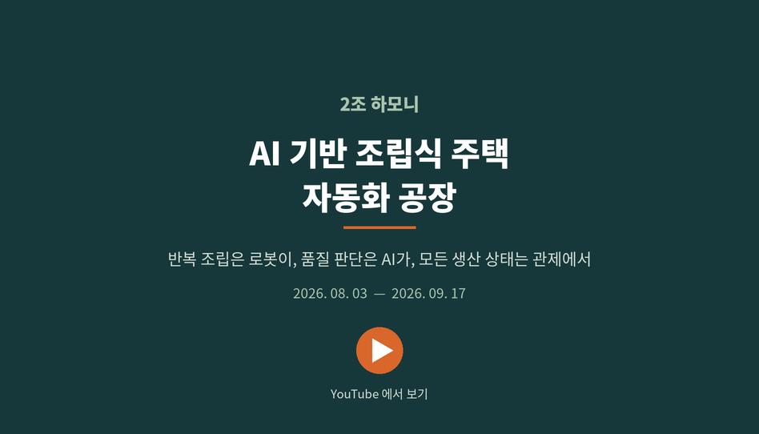
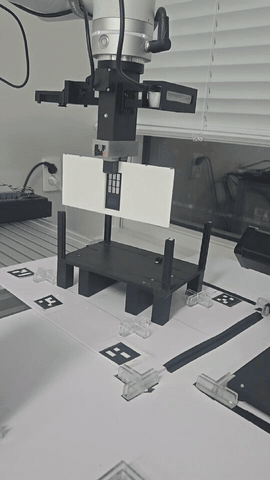
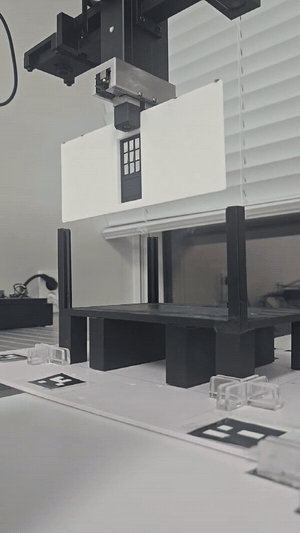
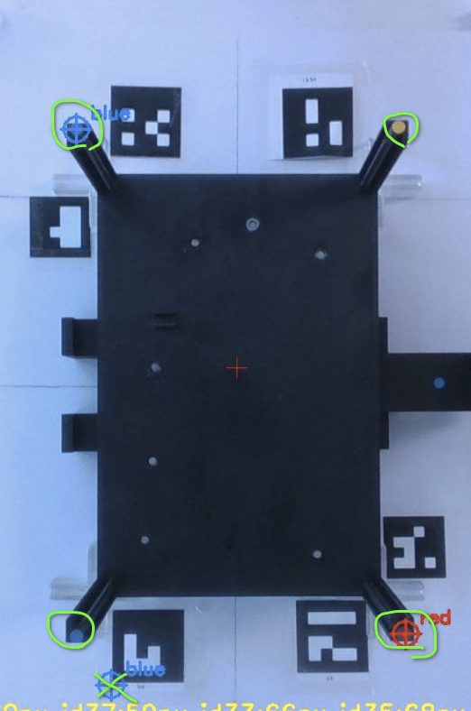
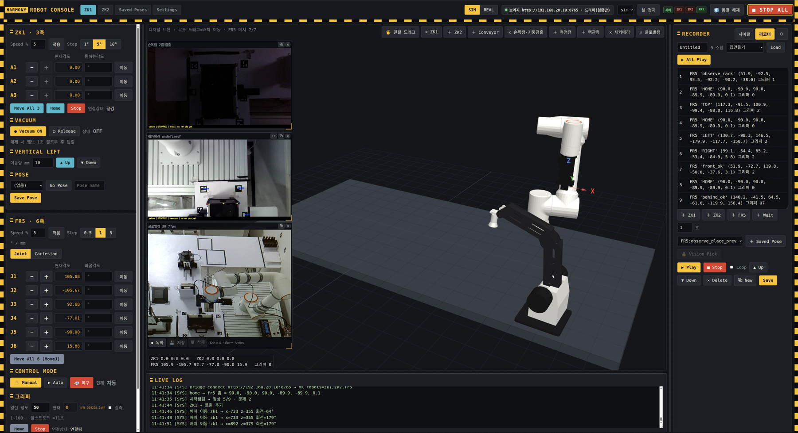
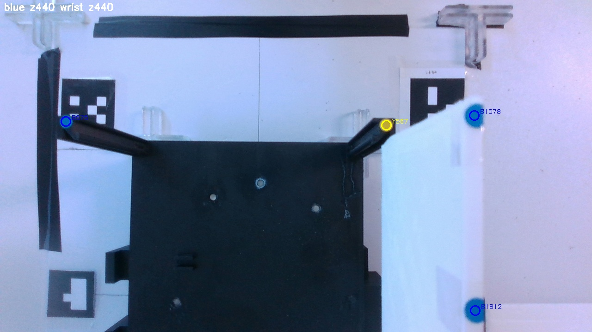
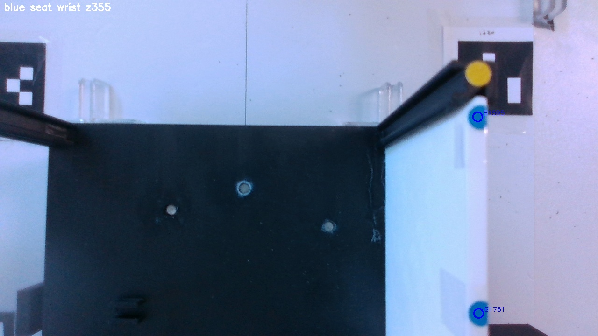

# FR5 · ZeKeep 로봇셀 - 조립식 주택 자동화 공장


FR5 6축 협동로봇이 벽을 집어 밑판 슬롯에 끼우고, ZeKeep 3축 로봇이 밑판 · 지붕을 반송하는 조립식 주택 생산 로봇셀입니다.
힘 · 토크 센서도 지그도 없이, **카메라 2대(손목 RGB-D D435 · 보조 RGB)만으로 밑판을 측정하고 벽을 정렬해 삽입**합니다.

4인 팀 프로젝트에서 **로봇 제어 · 비전 보정 · 서버 인터페이스 파트를 담당**했습니다.
이 저장소는 담당 파트의 코드 · 문서이며, 전체 시스템(AI 비전 검사, 서버/DB, 음성, Unity 관제)은
팀 저장소에 있습니다: [eduwing-robotics/ros2-ai-cobot-repo2](https://github.com/eduwing-robotics/ros2-ai-cobot-repo2)

<div align="center">
  <a href="https://youtu.be/2UZpkZqx2cw">
    
  </a>
  <br><b>▶ 프로젝트 시연 영상 (6분 40초)</b> - 이미지를 클릭하면 재생됩니다
</div>

## 최종 성과

| 항목  | 결과  | 측정 방법  |
| --- | --- | --- |
| 벽 전량 삽입 | **5 / 5** · 하강 중 막힘 0건 | 한 회차 다섯 장 전부 삽입, 로그 `── DONE` 기준 |
| 파지 재현 오차 | 1.7 mm → **0.13 mm** | 같은 벽 반복 파지 후 TCP 편차 |
| 정렬 수렴 잔차 | **0.41 mm** | 로봇 최소 실행 이동량(0.5 mm) 아래 = 한계 수렴 |
| 비틀린 밑판에서 삽입 | **−97° · 35 mm** 틀어진 밑판 | 절대좌표 0, 같은 프레임 안의 상대 정렬 |
| ZeKeep 반복 정밀도 | 3.1 mm → **0.55 mm** | 문서 · SDK 없는 PLC 로봇, MODBUS-RTU 직결 |
| ZeKeep 105 mm 직하강 | 반경 편차 **±2 mm** | 3축 관절 로봇에서 역기구학 유도로 수직 직선 |
| 사이클당 사람 개입 | **1회** (하강 확인) | 안전상 의도한 설계 |
| 완성품 출하 이송 | 도달 오차 **≤ 0.05 mm** | 포크 손잡이 파지 → 출하지 6단계 이동 |

> "5/5" 는 한 회차에서 다섯 장이 모두 들어갔다는 뜻이지 성공률이 아닙니다.
> 개발 기간 전체의 정지 기록은 [docs/05_verification.md](docs/05_verification.md) 에 그대로 적었습니다.

## 시연 장면

<table align="center">
  <tr>
    <td align="center" valign="bottom" width="50%">
      
    </td>
    <td align="center" valign="bottom" width="50%">
      
    </td>
  </tr>
  <tr>
    <td align="center" valign="top">
      <b>④ ALIGN - 상대 정렬 후 삽입</b><br>든 벽의 색점과 밑판 고정 특징을 같은 사진에서 비교
    </td>
    <td align="center" valign="top">
      <b>⑤ DESCEND - 카메라를 힘 센서로</b><br>3 mm 단계 하강 중 벽 점이 밀리면 그 자리에서 정지
    </td>
  </tr>
  <tr>
    <td align="center" valign="bottom">
      
    </td>
    <td align="center" valign="bottom">
      
    </td>
  </tr>
  <tr>
    <td align="center" valign="top">
      <b>① BASE - 매 사이클 밑판 재측정</b><br>기둥 색점 4점 + ArUco 고정 자로 위치 · 회전 산출
    </td>
    <td align="center" valign="top">
      <b>통합 운영 콘솔</b><br>조그 · 카메라 4대 · 관절 트윈 · 시퀀스 기록/재생
    </td>
  </tr>
  <tr>
    <td align="center" valign="bottom">
      
    </td>
    <td align="center" valign="bottom">
      
    </td>
  </tr>
  <tr>
    <td align="center" valign="top">
      <b>정렬 높이 기준 (z440)</b><br>이 사진의 점 배치가 곧 목표값이다
    </td>
    <td align="center" valign="top">
      <b>안착 기준 (z355)</b><br>좌표가 아니라 <b>사진 속 관계</b>를 기준으로 삼는다
    </td>
  </tr>
</table>

## 담당한 것

- **FR5 6축** - 벽 파지 · 운반 · 삽입 · 완성품 출하 전 구간, 브리지(SDK 단일 창구) · 동결 복구 · J6 대회전 봉인
- **ZeKeep 3축 ×2** - 제조사 문서 · SDK 없는 PLC 로봇을 MODBUS-RTU 로 직접 제어 (9,194줄)
- **비전 보정** - 밑판 측정 · 랙 파지점 계산 · 상대 정렬 · 하강 밀림 감시 (카메라 4대)
- **서버 인터페이스 계약** - Action / Service / Topic 설계 · 구현, 상태기계 · 오류코드 · 모의 어댑터
- **운영 콘솔** - 이종 로봇 2종을 한 화면에서 조그 · 시퀀스 기록/재생 · 실시간 관절 트윈

## 시스템 구성

```
서버 · FMS ──/cell/execute_task (Action)──▶ cell_orchestrator  ── task → phase 시퀀스 · 상태기계 · 오류코드
           ──/cell/control (Service)────▶       │
           ◀──/cell/status 1Hz ──────────       │ HTTP
           ◀──/fr5/joint_states 30Hz ────       ▼
                                          bridge_server (:8765)  ── FR5 명령 단일 창구 (SDK · 동결 복구 · J6 봉인)
                                                │ Ethernet 192.168.58.2
                                              FR5 6축
   house_cycle (:8776) ── 벽 삽입 파이프라인 · 비전 보정 ── 카메라 4대 (손목 D435 · 보조 · 측면 · 글로벌)
   zk_*.py ── ZeKeep 3축 ── MODBUS-RTU (USB 시리얼) ── 미쓰비시 FX3U PLC
```

- 3계층(작업 · 순서 · 하드웨어)으로 나눠, 로봇이 바뀌어도 상위 계층은 건드리지 않습니다.
- 모의(sim) 어댑터로 전 시퀀스를 먼저 통과시킨 뒤 실물에 투입합니다 (`fr5_adapter_mock_test.py`).
- 통신: CycloneDDS 유니캐스트(`config/cyclonedds_unicast.xml`), 팀 서버 도메인 73 · 글로벌캠 도메인 90.

| 로봇  | 역할  | 제어 경로  |
| --- | --- | --- |
| FR5 6축 | 벽 파지 · 운반 · 삽입 · 완성품 출하 | `bridge_server` → Fairino SDK (Ethernet) |
| ZeKeep 3축 ×2 | 밑판 · 지붕 흡착 반송 | `zk_*.py` → MODBUS-RTU → FX3U PLC (USB 시리얼) |

## 벽 한 장이 들어가기까지

```
① BASE     빈손 관측자세 → 밑판 기둥 색점 4점 + ArUco 고정 자로 위치 · 회전 측정 (매 사이클)
② RACK     랙 관측 → 벽 색점 중심으로 파지점 계산 → 파지        게이트: 벽 길이 ±2 %, 파지 편차 1.0 mm / 0.7°
③ CARRY    안전 고도 경유 → 슬롯 위 정렬 높이(z_seat + 85)
④ ALIGN    든 벽 색점 ↔ 밑판 고정 특징을 같은 사진에서 비교 → 기준 관계로 수렴   게이트: 정렬 이동 상한
⑤ DESCEND  3 mm 단계 하강 + 든 벽 점 밀림 감시 (카메라를 힘 센서로)          게이트: 밀리면 정지 · 후퇴
⑥ SEAT     기둥 점으로 안착 판정 → 개방 → 상승 → 다음 벽
⑦ 출하     완성품을 포크 손잡이째 출하지로 (fork_carry)
```

외벽 4장 → 내벽 순서는 물리적 강제입니다. 내벽을 먼저 넣으면 밑판 뎁스 검출이 갈려 기둥을 못 찾습니다.

## 실무에서 먼저 묻는 것

<details>
<summary><b>Q1. 핸드아이 캘리브레이션은 어떻게 했나요?</b></summary>

안 했습니다. 대신 **관측자세 1점에서 자코비안을 실측**했습니다. 로봇을 ±10 mm 조그시켜 픽셀이 얼마나 움직이는지 재고, 그 역행렬로 픽셀 오차를 mm 명령으로 바꿉니다.

**왜 이 선택이었나** - 2026-09-04 에 카메라 마운트를 교체하자 그때까지 쌓은 기준 데이터가 전량 무효가 됐습니다. 절대좌표 + 정밀 캘리브는 카메라가 조금만 움직여도 전부 무너집니다. 관측자세가 고정된 셀에서는 국소 자코비안 실측이 더 빠르고 정확했습니다.

**한계** - 관측자세 1점의 국소 선형화라 자세가 바뀌면 다시 재야 합니다. 다품종 · 다자세 라인이라면 핸드아이가 맞습니다.

</details>

<details>
<summary><b>Q2. 조명은 어떻게 통제했나요?</b></summary>

**통제하지 못했습니다.** 차광 인클로저도 편광 필터도 없이 소프트웨어로만 방어했고, 그래서 저녁이 되면 색상값이 낮과 달라졌습니다.

대신 이렇게 막았습니다 - 화이트밸런스 · 노출 · 게인을 **고정**(자동 WB 를 끄지 않은 것이 유령점의 진짜 원인이었습니다), 색별 서명 노출을 저장해두고 검출 대상 색마다 다른 노출로 촬영, 반사상은 색이 아니라 **배열 기하**로 배제.

조명 하드웨어가 있었으면 검출 문제의 상당 부분은 애초에 생기지 않았습니다. 산업 현장 순서는 ① 차광 ② 조명 고정 ③ 편광 ④ 소프트웨어인데, 우리는 ④부터 했습니다.

</details>

<details>
<summary><b>Q3. 지그를 쓰면 되지 않나요?</b></summary>

**지그를 쓸 수가 없습니다.** 밑판은 매 사이클 ZeKeep 로봇이 새로 놓습니다. 고정을 전제할 수 없는 것이 공정 조건 자체입니다.

2026-08-20 에 배치가 하루 두 번 바뀌면서 티칭한 자세가 전량 무효가 된 적이 있고, 그때 "고정을 전제하지 말자" 로 방향을 틀었습니다. 그래서 **매 사이클 밑판을 다시 측정**하고, **매 픽마다 랙을 다시 관측**합니다. 고정 좌표를 쓰는 구간이 0 입니다.

</details>

<details>
<summary><b>Q4. 반복 정밀도와 산포는요? 몇 회 검증했나요?</b></summary>

| 항목  | 값  | 조건  |
| --- | --- | --- |
| 파지 재현 오차 | 1.7 mm → 0.13 mm | 같은 벽 반복 파지 후 TCP 편차 |
| 파지 서명 산포 | 0.01 ~ 0.07 mm | 랙 위 · 그리퍼 문 상태에서만 측정 |
| 밑판 자세 측정 산포 | σ ≤ 0.014° · 0.065 mm | 다중 프레임 중앙값 |
| 정렬 수렴 잔차 | 0.41 mm | 로봇 최소 실행 이동량 아래 = 한계 |
| ZeKeep 반복 정밀도 | 3.1 mm → 0.55 mm | 2단계 스텝 + 가감속 300 ms |

기준값은 **1회 측정으로 저장하지 않습니다.** 파랑 기준을 한 번만 재서 저장했다가 1.15 mm 오차가 난 적이 있어서, 이후로는 다중 프레임 중앙값만 씁니다(5회 산포 0.03 px).

</details>

<details>
<summary><b>Q5. 사이클 타임은 얼마인가요?</b></summary>

**벽 한 장당 150초**입니다. 산업 조립 라인 기준으로는 느립니다.

300초에서 150초로 줄인 것이 전부이고, 지금 시간의 대부분은 **검증용 재측정과 단계별 정지**입니다. 더 줄이려면 재측정 횟수를 깎아야 하는데 그건 정확도와 직접 교환이라, "측정 품질에 닿는 것은 속도 대상이 아니다" 를 규칙으로 정하고 마감 전에는 손대지 않았습니다.

</details>

<details>
<summary><b>Q6. 힘 센서 없이 접촉을 어떻게 아나요?</b></summary>

**카메라를 힘 센서로 씁니다.** 3 mm 씩 단계 하강하면서 매 단계 든 벽의 색점이 픽셀 상에서 얼마나 움직였는지 봅니다. 벽이 기둥에 걸리면 그리퍼 안에서 밀리고, 그게 화면에 보이므로 그 자리에서 정지합니다.

**원리적 한계를 사고로 확인했습니다** - 2026-09-02, 기둥이 그리퍼 마찰보다 먼저 부러지면 카메라는 아무것도 보지 못합니다. 정공법은 F/T 센서 또는 순응(RCC) 장치입니다. 이후 무정지 하강을 버리고 잔스텝 감시 진입으로 바꿨습니다(감시 진입 성공 2 · 감지 2 vs 무정지 파손 1).

</details>

<details>
<summary><b>Q7. 로봇이 명령대로 움직인다고 어떻게 확신하나요?</b></summary>

**확신하지 않습니다.** 실측해보니 이랬습니다.

```
0.3 mm 명령  →  0 % 실행       (그런데 브리지는 "started" 로 응답)
0.5 mm 명령  →  100 % 실행
자세별 차이  →  랙 0.8 ~ 1.15 mm · 조립대 0.6 mm
```

명령이 버려졌는데 성공 응답이 오므로, **무동작을 성공으로 집계**하고 있었습니다. 이 사실을 모르고 검증 기준을 실행 분해능보다 촘촘하게 잡아둔 곳이 4군데였고 전부 헛돌고 있었습니다.

이후 `MIN_EXEC_MM` 아래의 보정은 아예 명령하지 않고, 검증 기준을 실행 분해능 위로 다시 세웠습니다.

</details>

<details>
<summary><b>Q8. 문서 없는 PLC 로봇을 어떻게 제어했나요?</b></summary>

ZeKeep 은 제조사 문서도 SDK 도 없고 티칭 펜던트로만 움직이는 3축 PLC 로봇이었습니다.

1. **HMI 화면을 조작하며 M비트 · D레지스터 스냅샷을 비교** - 버튼 하나씩 누르고 변한 주소만 추출해 모드 `D90` · 기동 `M301+M21` 을 특정
2. **MODBUS-RTU 직결** - USB 시리얼로 PLC 에 직접 지령, 파이썬에서 자세 · 속도 · 원점 제어
3. **역기구학 직접 유도** - 3축 관절 구조라 카티시안 보간이 없어서 `r = L1·sin(Q2−A2) + L2·cos(Q3−A3)` 를 유도, `r` 을 고정하면 수직 직선이 됩니다

**한계** - 오버슛의 바닥은 **통신 지연 150 ms** 입니다. 조그 제어로 0.5° 이하는 원리적으로 불가능하고, 그 아래는 DDRVA 직접구동 영역인데 목표 무시 위험을 확인하고 봉인했습니다.

</details>

## 트러블슈팅

| 증상  | 진범  | 해결  |
| --- | --- | --- |
| 하강이 중간에 멈춤 | 런처가 손목캠 화이트밸런스를 5500 K 로 강제 주입(기본 4600 K) → 파랑 색점 면적 **1823 → 258** 붕괴 | WB 3중 고정(런처 · 자동복구 · 사이클 시작 점검) + 색별 서명 노출 |
| 없는 점이 검출됨(유령점) | 오버레이를 소스 버퍼에 그려 **다음 프레임이 자기 그림을 재검출**. 자동 WB 미차단 | 검출은 원본 사본에서 · 반사상은 색이 아닌 배열 기하로 배제 |
| 빨강 벽 6연속 삽입 실패 | 티칭한 손목 rx / ry 를 버리고 관측자세 값을 상속(수직 대비 1.16 ~ 1.46°) → 벽 밑동 **2.0 ~ 2.2 mm** 이탈 | 파지 자세에 티칭값을 그대로 유지 |
| 빨강 벽 점이 조각나 사라짐 | 빨강 HSV 가 색상환 한쪽만 잡고 있었음 (실측 H 3~17 인데 범위는 135~179). 표가 **두 군데**라 한쪽만 고치면 절반만 나음 | 두 표 모두 수정 → 벽 점 면적 617 → 2790 |
| 검증 기준이 헛돌음 | 0.3 mm 명령은 실행되지 않고도 `started` 로 응답. 실행 분해능이 **자세마다 다름** | 최소 실행 이동량을 실측해 검증 기준을 다시 세움 |
| 정렬 보정이 오차를 2배로 키움 | 픽셀 → 로봇 보정 부호가 반대. `J·Δpx` 는 "카메라가 어디로 갔나" 이지 "어디로 되돌려야 하나" 가 아님 | 부호를 음수로. **부호는 Δ≠0 에서만 검증 가능** (Δ≈0 통과는 검증이 아님) |
| MoveIt SUCCESS 인데 실물 무동작 | 컨트롤러 알람 (main/sub error, ServoJ 코드 14) | `ResetAllError()` 로 복구 - 전원 재투입 불필요 |
| 스택 기동 시 write 1초씩 밀림 | 개통 순서 위반 - `Mode(0)` / `RobotEnable(1)` 없이 `real_robot` 기동 | `ActGripper → Mode → RobotEnable → real_robot` 순서 강제 (`fr5_up.sh`) |
| 재기동해도 로봇이 안 붙음 | `ros2 run` **래퍼만 죽고 실 바이너리가 SDK 를 점유** | 바이너리 경로로 직접 종료 + `ss` 로 소켓 해제 확인 |
| 알람 없는 무동작 · SDK 전 명령 −2 | 랜선 접촉불량 (carrier 0) | 물리 재삽입 + `nmcli con up fr5-wired` (100M/full/autoneg yes 고정) |
| 내벽 넣으면 기둥 0/4 검출 | 내벽이 밑판 뎁스를 반으로 가름 + `OPEN(61)` 이 10 px 이음매를 끊음 | `CLOSE(21)` 선행 + 맞닿은 조각 합치기, **삽입 순서 외벽 4 → 내벽 고정** |
| 컨트롤러 동결 (controller_dead) | J6 대회전(180° 초과) · 페이로드 미등록 · 충돌 알람 | J6 봉인 가드 · 페이로드 0.7 kg 등록 · `fr5_rescue.sh` |

## 핵심 파라미터

| 파라미터  | 값  | 설명  |
| --- | --- | --- |
| `HOVER_DZ` | 85 (외벽) / 100 (blue_in · yellow_in) / 102 (red_in) | 안착 높이 위 정렬 높이 (mm) |
| `COMBINE_TOL_MM` | 1.5 | 두 카메라 XY 불일치 허용 |
| `ALIGN_MAX_MOVE_TWOCAM_MM` | 15 | 정렬 결과가 슬롯 기준에서 벗어나도 되는 상한 |
| `MIN_EXEC_MM` | 0.8 | 로봇 최소 실행 이동량 - 이보다 작은 보정은 명령하지 않음 |
| `WALL_PAIR_MAX_PX` | 90 | 기준 벽 점 ↔ 측정 벽 점 짝 허용 거리 (점 간격 192 px 의 절반 미만) |
| `JAM_STEP` / `SPD_SLOW` | 3 mm / 1 % | 하강 걸음 · 진입부 속도 |
| `EXPO_SETTLE_S` | 1.4 | 노출 변경 후 프레임 안정 대기 |
| `PRECORR_MAX_MM` | 0 | 파지 편차 선보정 상한 (정렬이 흡수) |
| 파지 게이트 | 1.0 mm / 0.7° | 넘으면 재파지 - 정렬은 파지 오차를 2배로 증폭한다 |
| ZeKeep `D90` / `M301+M21` | - | PLC 모드 레지스터 · 기동 비트 (HMI diff 로 특정) |

## 설계에서 지킨 것

- **절대좌표를 쓰지 않는다** - 밑판은 매 사이클 다른 로봇이 새로 놓는다. 든 벽의 점과 밑판 고정 특징을 한 장의 사진에서 비교해 그 관계가 기준과 같아질 때까지만 움직인다. 카메라가 옮겨져도 살아남는다.
- **자코비안은 문서가 아니라 실측으로** - 로봇을 조그시켜 픽셀 변화를 재서 역행렬을 만든다. 부호는 오차가 0 이 아닌 상태에서만 검증한다.
- **게이트는 통과 장치가 아니라 감지기** - 게이트에 걸리면 완화하지 않고 검출을 보강하거나 사람에게 넘긴다. 완화 3건을 넣었다가 막힌 벽을 계속 누른 뒤 전량 원복했다.
- **로봇을 의심한다** - 0.3 mm 명령은 실행되지 않고도 `started` 로 답한다. 실행 분해능을 실측해 검증 기준을 다시 세웠다.
- **성공 로그를 믿지 않는다** - 판정은 로그의 `── DONE` / `❌` 로만 한다. 무동작이 성공으로 집계되는 경로가 5종 있었다.
- **카메라를 힘 센서로** - 힘 · 토크 센서 없이 3 mm 단계 하강 + 벽 점 밀림 감시로 접촉을 읽는다. 기둥이 먼저 부러지는 경우는 원리적으로 못 잡는다(한계).
- **실패 후 부품 복귀는 사람이** - 로봇이 부품을 랙에 되돌리지 않는다. 문 채 멈추고 상태만 보고한다.

## 저장소 구조

```
.
├── src/
│   ├── fr5_cycle/          벽 삽입 파이프라인 · 비전 보정 (house_cycle, hover_align, place_calc …)
│   ├── bridge/             FR5 명령 단일 창구 (bridge_server.py, :8765)
│   ├── orchestrator/       서버 계약 구현 - Action/Service/Topic, 상태기계, 오류코드, 모의 어댑터
│   ├── cell_interfaces/    ROS 2 인터페이스 정의 (ExecuteTask.action, CellControl.srv, GetPickPose.srv …)
│   ├── cameras/            카메라 서버 · 글로벌캠 중계 · 자동복구 데몬
│   ├── console/            통합 운영 콘솔 (조그 · 시퀀스 기록/재생 · 관절 트윈 · 카메라 4대)
│   └── zekeep/             ZeKeep 3축 PLC 제어 도구 (9,194줄) · 2호기 세팅 기록
├── scripts/                기동 · 복구 스크립트 (fr5_up, fr5_rescue, start_console, start_factory_view …)
├── config/                 티칭 · 캘리브레이션 결과 - 집 타입별 기준(house_a/house_b), 카메라→로봇 매핑
├── cad/                    주택 A · B 벽체 · 밑판 · 다리 STL (실제 출력해 조립한 부품)
└── docs/                   01 개요 ~ 07 구조 + 이미지 (문서 목록은 docs/README.md)
```

## 실행 방법

로봇셀 PC 한 대에서 전부 올립니다. FR5 는 전용 유선(192.168.58.x), 팀 서버는 무선(192.168.20.x)입니다.

```bash
# 1. FR5 로봇 스택 - 그리퍼 활성화 → real_robot 순서를 지킨다
./scripts/fr5_up.sh

# 2. 카메라 · 콘솔 · 벽 삽입 사이클 서버
./scripts/start_console.sh

# 3. 서버 계약 노드 (팀 도메인 73, 실물은 exec_mode:=real)
source scripts/team_env.sh
python3 src/orchestrator/cell_orchestrator.py --ros-args -p exec_mode:=real

# 4. 글로벌캠 → Unity 관제 송신 (C270 은 이 스택이 소유한다)
./scripts/start_factory_view.sh

# 5. 브라우저
#    http://<PC>:8000/bf2_robot_console.html   통합 콘솔
#    http://<PC>:8776/                          벽 삽입 사이클 (하강 버튼은 사람이 누른다)
```

| 포트  | 서비스  | 파일  |
| --- | --- | --- |
| 8765 | FR5 브리지 | `src/bridge/bridge_server.py` |
| 8766 / 8768 / 8771 / 8779 | 손목 D435 / 보조 / 측면 / 글로벌 카메라 | `src/cameras/` |
| 8776 | 벽 삽입 사이클 | `src/fr5_cycle/house_cycle.py` |
| 8773 / 8777 | 단계별 기준점 오버레이 뷰 | `src/fr5_cycle/pillar_view.py` · `ref_view.py` |
| 8000 | 통합 운영 콘솔 | `src/console/bf2_robot_console.html` |

컨트롤러가 동결되면 `scripts/fr5_rescue.sh` (전원 재투입 → 펜던트 알람 Clear 는 사람 → 링크 복구 → 브리지 rescue).

## 한계

- **조명을 통제하지 못했다.** 차광 인클로저 · 편광 필터 없이 소프트웨어로만 방어해서, 저녁이 되면 색상값이 낮과 달라졌다.
- **자코비안은 관측자세 1점의 국소 선형화**다. 자세가 바뀌면 다시 재야 한다. 다품종 · 다자세 라인이라면 핸드아이 캘리브레이션이 맞다.
- **사이클 타임 150초**는 산업 기준으로 느리다. 시간의 대부분이 검증용 재측정과 단계별 정지이고, 정확도와 직접 교환이라 마감 전에는 손대지 않았다.
- **B타입만 완주했다.** A타입은 기준 전체 재티칭이 남았고, `cell_orchestrator` 와 `house_cycle` 은 아직 직결되지 않아
  서버 명령으로 벽을 넣는 경로는 고정 티칭 어댑터를 거친다.
- **접촉 감지는 기둥이 그리퍼 마찰보다 먼저 부러지면 무력**하다. 2026-09-02 기둥 파손으로 확인했다. 정공법은 F / T 센서 또는 순응(RCC) 장치.

## 참고 자료

- [문서 목록](docs/README.md) - 01 개요 · 02 아키텍처 · 03 주요 기능 · 04 데이터 흐름 · 05 검증 · 06 범위 · 07 구조
- [팀 저장소](https://github.com/eduwing-robotics/ros2-ai-cobot-repo2) - AI 비전 검사 · 서버/DB · 음성 · Unity 관제
- [시연 영상](https://youtu.be/2UZpkZqx2cw) (6분 40초)
